# Imbalanced-Data-Pipeline
Imbalanced-Data-Pipeline is a capstone project for the Data Engineering training program conducted by Digital Future Academy. The project focuses on extracting, cleaning, transforming, and synthetically generating multiple versions of an imbalanced dataset with varying imbalance rates using oversampling techniques, and loading to database.

---
---
## PROJECT REQUIREMENTS

The **SavePlanet**, hereafter referred to as the “Customer,” is an environmental conservation organization that has approached us with a requirement to create multiple datasets with varying imbalance rates from a highly imbalanced Abalone dataset provided in a CSV file. The objective is to enable their Data Scientists to train Machine Learning models and evaluate how different imbalance rates affect the models’ performance metrics.
The Customer requires a robust ETL pipeline capable of extracting the provided Abalone dataset from the CSV file. The pipeline must efficiently clean, encode, and standardize the data while removing invalid or incomplete records. Furthermore, it should generate multiple versions of the dataset with varying imbalance rates. This will allow the Company’s Data Scientists to train and test various ML classifiers on each dataset version and analyze the impact of imbalance on key performance metrics such as accuracy, precision, recall, AUC, and Cohen’s Kappa.
Finally, all generated datasets, reflecting different imbalance rates, must be stored in one or more tables in a relational database, ensuring they are easily accessible for downstream analysis and modeling tasks.


---
---

## PROJECT REQUIREMENTS AS AN EPIC

```text

As the CUSTOMER, I want a robust ETL pipeline that extracts, cleans, encodes, standardizes, and enriches the Abalone dataset from a CSV source, generating multiple versions of the dataset with imbalance rates; So that Data Scientists and Data Analysts can train and evaluate ML models on datasets with varying imbalance levels and assess the impact of imbalance on model performance using the  The processed using an up-to-date imbalanced datasets stored in SQL database.
```

---
---
## EPIC Breakdown:
<details> 

<summary><b>EPIC 1 – Robust Data Extraction:</b></summary>

```text
As a Data Scientist/ Data Analyst at SavePlanet, 
I want a reliable ETL pipeline that can extract the Abalone dataset from a CSV file so that I have accurate and complete raw data available for analysis and modeling

```
</details>

<details> 

<summary><b>EPIC 2 – Data Cleaning and Standardization:</b></summary>

```text
As a Data Scientist at SavePlanet, 
I want the ETL pipeline to clean, encode, and standardize the Abalone dataset while removing invalid or incomplete records so that I can trust the quality of the data used in ML model training.

```

</details>
<details> 

<summary><b>EPIC 3 – Generating Imbalanced Dataset Versions:</b></summary>

```text
As a Data Scientist at SavePlanet, 
I want the pipeline to generate multiple versions of the Abalone dataset with varying imbalance rates so that I can evaluate how imbalance affects the performance of different ML models.

```
</details>
<details> 

<summary><b>EPIC 4 – Storing Datasets in a Relational Database:</b></summary>

```text
As a Data Scientist at SavePlanet, 
I want all generated dataset versions to be stored in relational database tables so that I can easily access them for downstream analysis and model training.

```
</details>
<details> 

<summary><b>EPIC 5 – Supporting ML Model Evaluation:</b></summary>

```text
As a Data Scientist at SavePlanet, 
I want the datasets to allow training and testing of multiple ML classifiers and analysis of key performance metrics (accuracy, precision, recall, AUC, Cohen’s Kappa) so that I can understand the impact of imbalance on model performance.

```

</details>

---
---
# EPICS User Stories:
<details>
  <summary><b>EPIC 1 – Robust Data Extraction:</b> </summary>
  
  - <b>User Story 1.1:</b> As a Data Scientist, I want the ETL pipeline to read the Abalone dataset from a CSV file.

  - User Story 1.2: As a Data Scientist, I want the pipeline to validate the CSV file format before extraction.
  
</details>
<details>
  <summary><b>EPIC 2 – Data Cleaning and Standardization:</b> </summary>
  
  - User Story 2.1: As a Data Scientist at SavePlanet, I want the ETL pipeline to remove invalid or incomplete records from the dataset, so that the data used for ML modeling is clean and reliable.

- User Story 2.2: As a Data Scientist, I want categorical features to be encoded properly, so that ML models can process the data efficiently.

- User Story 2.3: As a Data Scientist, I want numerical features to be standardized, so that the data is normalized for consistent model training and comparison.

</details>

<details>
  <summary><b>EPIC 3 – Generating Imbalanced Dataset Versions:</b> </summary>
  
- User Story 3.1: As a Data Scientist at SavePlanet, I want the ETL pipeline to generate multiple versions of the Abalone dataset with different imbalance rates (e.g., 5%, 10%, 15%, …), so that I can evaluate model performance under varying data distributions.

- User Story 3.2: As a Data Scientist, I want the pipeline to document the imbalance ratio for each generated dataset, so that I know exactly which dataset corresponds to which imbalance scenario.


</details>

<details>
  <summary><b>EPIC 4 – Storing Datasets in a Relational Database:</b> </summary>
  
- User Story 4.1: As a Data Scientist at SavePlanet, I want each version of the generated dataset to be stored in relational database tables, so that I can easily access them for downstream analysis.

- User Story 4.2: As a Data Scientist, I want the pipeline to maintain metadata for each dataset version in the database (e.g., creation timestamp, imbalance rate), so that I can track and manage all datasets efficiently.

</details>

<details>
  <summary><b>EPIC 5 – Supporting ML Model Evaluation:</b> </summary>
  
- User Story 5.1: As a Data Scientist at SavePlanet, I want to use each version of the dataset to train and test multiple ML classifiers, so that I can analyze how imbalance affects different model types.

- User Story 5.2: As a Data Scientist, I want to calculate performance metrics such as accuracy, precision, recall, AUC, and Cohen’s Kappa for each model on each dataset, so that I can compare their performance across imbalance rates.

- User Story 5.3: As a Data Scientist, I want to visualize model performance metrics across datasets with varying imbalance rates, so that I can easily interpret the impact of imbalance on model performance.


</details>
---
---

## User Stories Tasks:

<details>
    <summary>User Story 1.1:</summary>

- <b>Tasks:</b>
    - Identify the location and filename of the CSV dataset.
    - Load the CSV file using Pandas or another library.
    - Verify that the file is readable and accessible.
    - Log extraction success or errors for traceability.

</details>

<details>
    <summary>User Story 1.2:</summary>

- <b>Tasks:</b>
    - Check that all expected columns exist in the CSV.
    - Verify data types for each column (numeric, categorical).
    - Handle missing or extra columns appropriately.
    - Raise warnings or errors if the CSV does not match expectations.

</details>

<details>
    <summary>User Story 2.1:</summary>

- <b>Tasks:</b>
    - Identify missing, null, or invalid values.
    - Remove rows with critical missing values.
    - Impute missing values for non-critical columns if needed.
    - Remove duplicate records.
    - Log records removed or corrected.


</details>

<details>
    <summary>User Story 2.2:</summary>
- <b>Tasks:</b>
    - Identify categorical columns.
    - Apply one-hot encoding or label encoding as appropriate.
    - Verify encoding correctness.
    - Ensure encoded data aligns with model input requirements.


</details>

<details>
    <summary>User Story 2.3:</summary>

- <b>Tasks:</b>
    - Identify numerical columns for standardization.
    - Apply Z-score scaling or Min-Max normalization.
    - Validate the standardized values.
    - Ensure transformed data integrates with encoded categorical features.


</details>

<details>
    <summary>User Story 3.1:</summary>

- <b>Tasks:</b>
    - Define imbalance rates (5%, 10%, 15%, … up to 100%).
    - Apply oversampling or undersampling methods to achieve target ratios.
    - Validate the class distribution in each generated dataset.
    - Log the number of records per class for traceability.
    - Save each dataset version for downstream tasks.

</details>

<details>
    <summary>User Story 4.1:</summary>

- <b>Tasks:</b>
    - Design the database schema or table structure to store multiple dataset versions.
    - Establish connection to the database (e.g., PostgreSQL, MySQL).
    - Write each dataset version into the database table(s).
    - Verify data insertion was successful for each table/version.
    - Ensure datasets are easily accessible for querying and ML training.
</details>

<details>
    <summary>User Story 5.1:</summary>

- <b>Tasks:</b>
    - Split each dataset version into training and testing sets.
    - Select ML classifiers (e.g., Logistic Regression, Random Forest, XGBoost).
    - Train models on the training data.
    - Test models on the test data.
    - Store trained models and predictions for evaluation.
</details>

<details>
    <summary>User Story 5.2:</summary>

- <b>Tasks:</b>
    - Compute required performance metrics for each model on each dataset version.
    - Visualize results using tables or plots (bar charts, line charts, heatmaps).
    - Compare performance across different imbalance rates.
    - Document insights and recommendations based on observed performance differences.
</details>


# USER STORIES ACCEPTANCE CRITERIA: 
<details>
    <summary> USER STORY 1.1:</summary>
</details>

<details>
    <summary> USER STORY 1.2:</summary>
</details>
<details>
    <summary> USER STORY 2.1:</summary>
</details>

<details>
    <summary> USER STORY 2.2:</summary>
</details>
<details>
    <summary> USER STORY 2.3:</summary>
</details>
<details>
    <summary> USER STORY 3.1:</summary>
</details>
<details>
    <summary> USER STORY 3.2:</summary>
</details>
<details>
    <summary> USER STORY 4.1:</summary>
</details>
<details>
    <summary> USER STORY 4.2:</summary>
</details>
<details>
    <summary> USER STORY 5.1:</summary>
</details>
<details>
    <summary> USER STORY 5.2:</summary>
</details>
<details>
    <summary> USER STORY 5.3:</summary>
</details>

---
---

## Definition of Done

- [ ] All subtasks are completed
- [ ] All tests are passing
- [ ] Code coverage is at least 80%
- [ ] Code is linted and follows style guidelines
- [ ] All performance metrics are met
- [ ] Documentation is updated
- [ ] Code is merged into the main branch


# Project Kanban Board

### Activity 1: Extracting the Data

```mermaid
kanban
    Epics
        (Epic 1: As a Data Scientist/ Data Analyst at SavePlanet, I want a reliable ETL pipeline that can extract the Abalone dataset from a CSV file so that I have accurate and complete raw data available for analysis and modeling)
        (Epic 2: As a Data Scientist at SavePlanet, I want the ETL pipeline to clean, encode, and standardize the Abalone dataset while removing invalid or incomplete records so that I can trust the quality of the data used in ML model training.)
        (Epic 3: As a Data Scientist at SavePlanet, I want the pipeline to generate multiple versions of the Abalone dataset with varying imbalance rates so that I can evaluate how imbalance affects the performance of different ML models.)
        (Epic 4: As a Data Scientist at SavePlanet, I want all generated dataset versions to be stored in relational database tables so that I can easily access them for downstream analysis and model training.)
        (Epic 5: As a Data Scientist at SavePlanet, I want the datasets to allow training and testing of multiple ML classifiers and analysis of key performance metrics - accuracy, precision, recall, AUC, Cohen’s Kappa- so that I can understand the impact of imbalance on model performance.)
    Users Stories:
        (Epic 1 Story 1.1: As a Data Scientist, I want the ETL pipeline to read the Abalone dataset from a CSV file.)
        (Epic 1 Story 1.2: As a Data Scientist, I want the pipeline to validate the CSV file format before extraction.)
        (Epic 2 Story 2.1: As a Data Scientist at SavePlanet, I want the ETL pipeline to remove invalid or incomplete records from the dataset, so that the data used for ML modeling is clean and reliable.)
        (Epic 2 Story 2.2: As a Data Scientist, I want categorical features to be encoded properly, so that ML models can process the data efficiently.)
        (Epic 2 Story 2.3: As a Data Scientist, I want numerical features to be standardized, so that the data is normalized for consistent model training and comparison. )
        (Epic 3 Story 3.1:As a Data Scientist at SavePlanet, I want the ETL pipeline to generate multiple versions of the Abalone dataset with different imbalance rates : e.g., 5%, 10%, 15%, …, so that I can evaluate model performance under varying data distributions. )
        (Epic 3 Story 3.2: As a Data Scientist, I want the pipeline to document the imbalance ratio for each generated dataset, so that I know exactly which dataset corresponds to which imbalance scenario.)
        (Epic 4 Story 4.1: As a Data Scientist at SavePlanet, I want each version of the generated dataset to be stored in relational database tables, so that I can easily access them for downstream analysis.)
        (Epic 4 Story 4.2: As a Data Scientist, I want the pipeline to maintain metadata for each dataset version in the database e.g., creation timestamp, imbalance rate, so that I can track and manage all datasets efficiently.)
        (Epic 5 Story 5.1: As a Data Scientist at SavePlanet, I want to use each version of the dataset to train and test multiple ML classifiers, so that I can analyze how imbalance affects different model types.)
        (Epic 5 Story 5.2: As a Data Scientist, I want to calculate performance metrics such as accuracy, precision, recall, AUC, and Cohen’s Kappa for each model on each dataset, so that I can compare their performance across imbalance rates.)
        (Epic 5 Story 5.3: As a Data Scientist, I want to visualize model performance metrics across datasets with varying imbalance rates, so that I can easily interpret the impact of imbalance on model performance.)
    To Do:  
        Task 1.1.1: Identify the location and filename of the CSV dataset.
        Task 1.1.2: Load the CSV file using Pandas or another library.
        Task 1.1.3: Verify that the file is readable and accessible.
        Task 1.1.4: Log extraction success or errors for traceability.

    In Progress:

    Done:
        None
```





    
    
    


