## PROJECT REQUIREMENTS

The **SavePlanet**, hereafter referred to as the “Customer,” is an environmental conservation organization that has approached us with a requirement to create multiple datasets with varying imbalance rates from a highly imbalanced Abalone dataset provided in a CSV file. The objective is to enable their Data Scientists to train Machine Learning models and evaluate how different imbalance rates affect the models’ performance metrics.
The Customer requires a robust ETL pipeline capable of extracting the provided Abalone dataset from the CSV file. The pipeline must efficiently clean, encode, and standardize the data while removing invalid or incomplete records. Furthermore, it should generate multiple versions of the dataset with varying imbalance rates. This will allow the Company’s Data Scientists to train and test various ML classifiers on each dataset version and analyze the impact of imbalance on key performance metrics such as accuracy, precision, recall, AUC, and Cohen’s Kappa.
Finally, all generated datasets, reflecting different imbalance rates, must be stored in one or more tables in a relational database, ensuring they are easily accessible for downstream analysis and modeling tasks.

---
---

# Project Title: Imbalanced-Data-Pipeline
**Imbalanced-Data-Pipeline is a capstone project for the Data Engineering training program conducted by Digital Future Academy. The project focuses on:**

- Extracting, cleaning, and transforming raw datasets.
- Generating multiple versions of imbalanced datasets with varying imbalance rates using oversampling       techniques.
- Loading the processed data into a relational database for storage and analysis.
- Training ML models (K-Nearest Neighbors, Support Vector Machine, Random Forest, XGBoost) and analyzing the effect of imbalance rate on their performance.

---
---

# Project Structure:

```markdown
Imbalanced-Data-Pipeline/
│── config/
│── data/                     # raw, cleaned, and resampled datasets 
│── notebooks/                # Experiment and EDA
│── scripts/
│   └── run_etl.py            # Main entrypoint for ETL
│── src/
│   ├── extract/              # Data extraction logic
│   ├── transform/            # Data cleaning & transformation
│   ├── load/                 # Database loading 
|── stream_visualization/     # Streamlit app         
│── requirements.txt          # Dependencies
│── README.md                 # Project documentation
│── .env.dev                  # Environment config

```

# Setup / Installation:
**1. Clone The Repository:**
```markdown
git clone https://github.com/NMAtapoor/Imbalanced-Data-Pipeline.git
cd Imbalanced-Data-Pipeline
```

**2. Create and activate a virtual environment:**
```markdown
    python -m venv .venv
    source .venv/bin/activate   # Linux/Mac
    source .venv\Scripts\activate      # Windows
```
**3. Install dependencies:**
```markdown
pip install -r requirements.txt
```
**4. Configure environment variables:**
Create a `.env.dev` file in the project root with the following:
```markdown
DB_HOST=localhost
DB_PORT=5432
DB_NAME=mydb
DB_SCHEMA=nysch
DB_USER=myuser
DB_PASSWORD=mypassword
```
**5. Run the ETL pipeline:**
```markdown
run_etl dev
```
## Run the Streamlit Application:
To run the streamlit app, execute the following code on bash script:
```markdown
cd streamlit_visualization
streamlit run streamlit_visualiz.py
```
---
---

# Project Plan:

## PROJECT REQUIREMENTS AS AN EPIC

```text

As the CUSTOMER, I want a robust ETL pipeline that extracts, cleans, encodes, standardizes, and enriches the Abalone dataset from a CSV source, generating multiple versions of the dataset with imbalance rates; So that Data Scientists and Data Analysts can train and evaluate ML models on datasets with varying imbalance levels and assess the impact of imbalance on model performance using an up-to-date imbalanced datasets stored in SQL database.
```

---
---
## EPIC Breakdown:
<details> 

<summary><b>EPIC 1 – Robust Data Extraction:</b></summary>

```text
As a Data Scientist/ Data Analyst at SavePlanet, 
I want a reliable ETL pipeline that can extract the Abalone dataset from a CSV file so that I have accurate and complete raw data available for analysis and modeling

```
</details>

<details> 

<summary><b>EPIC 2 – Data Cleaning and Standardization:</b></summary>

```text
As a Data Scientist at SavePlanet, 
I want the ETL pipeline to clean, encode, and standardize the Abalone dataset while removing invalid or incomplete records so that I can trust the quality of the data used in ML model training.

```

</details>
<details> 

<summary><b>EPIC 3 – Generating Imbalanced Dataset Versions:</b></summary>

```text
As a Data Scientist at SavePlanet, 
I want the pipeline to generate multiple versions of the Abalone dataset with varying imbalance rates so that I can evaluate how imbalance affects the performance of different ML models.

```
</details>
<details> 

<summary><b>EPIC 4 – Storing Datasets in a Relational Database:</b></summary>

```text
As a Data Scientist at SavePlanet, 
I want all generated dataset versions to be stored in relational database tables so that I can easily access them for downstream analysis and model training.

```
</details>
<details> 

<summary><b>EPIC 5 – Supporting ML Model Evaluation:</b></summary>

```text
As a Data Scientist at SavePlanet, 
I want the datasets to allow training and testing of multiple ML classifiers and analysis of key performance metrics (accuracy, precision, recall, AUC, Cohen’s Kappa) so that I can understand the impact of imbalance on model performance.

```

</details>

---
---
# EPICS User Stories:
<details>
  <summary><b>EPIC 1 – Robust Data Extraction:</b> </summary>
  
  - <b>User Story 1.1:</b> As a Data Scientist, I want the ETL pipeline to read the Abalone dataset from a CSV file.
  
</details>
<details>
  <summary><b>EPIC 2 – Data Cleaning and Standardization:</b> </summary>
  
  - User Story 2.1: As a Data Scientist at SavePlanet, I want the ETL pipeline to remove invalid or incomplete records from the dataset, so that the data used for ML modeling is clean and reliable.

- User Story 2.2: As a Data Scientist, I want categorical features to be encoded properly, so that ML models can process the data efficiently.

- User Story 2.3: As a Data Scientist, I want numerical features to be standardized, so that the data is normalized for consistent model training and comparison.

</details>

<details>
  <summary><b>EPIC 3 – Generating Imbalanced Dataset Versions:</b> </summary>
  
- User Story 3.1: As a Data Scientist at SavePlanet, I want the ETL pipeline to generate multiple versions of the Abalone dataset with different imbalance rates (e.g., 5%, 10%, 15%, …), so that I can evaluate model performance under varying data distributions.
- User Story 3.2: As a Data Scientist, I want the pipeline to maintain a column such for each dataset version, so that I can track and manage all datasets efficiently.

</details>

<details>
  <summary><b>EPIC 4 – Storing Datasets in a Relational Database:</b> </summary>
  
- User Story 4.1: As a Data Scientist at SavePlanet, I want each version of the generated dataset is merged and to be stored in relational database tables, so that I can easily access them for downstream analysis.

</details>

<details>
  <summary><b>EPIC 5 – Supporting ML Model Evaluation:</b> </summary>
  
- User Story 5.1: As a Data Scientist at SavePlanet, I want to use each version of the dataset to train and test multiple ML classifiers, so that I can analyze how imbalance affects different model types.

- User Story 5.2: As a Data Scientist, I want to calculate performance metrics such as accuracy, precision, recall, AUC, and Cohen’s Kappa for each model on each dataset, so that I can compare their performance across imbalance rates.

- User Story 5.3: As a Data Scientist, I want to visualize model performance metrics across datasets with varying imbalance rates, so that I can easily interpret the impact of imbalance on model performance.

</details>

## User Stories Tasks:

<details>
    <summary>User Story 1.1:</summary>

- <b>Tasks:</b>
    - Load the CSV file using Pandas or another library.
</details>

<details>
    <summary>User Story 1.2:</summary>

- <b>Tasks:</b>
    - Check that all expected columns exist in the CSV.
    - Verify data types for each column - numeric, categorical.
    - Handle missing or extra columns and types appropriately.

</details>

<details>
    <summary>User Story 2.1:</summary>

- <b>Tasks:</b>
    - Identify missing, null, or invalid values.
    - Remove rows with critical missing values.
    - Impute missing values for non-critical columns if needed.
    - Check for duplicate and remove duplicate records.
</details>

<details>
    <summary>User Story 2.2:</summary>

- <b>Tasks:</b>
    - Identify categorical columns.
    - Apply one-hot encoding or label encoding as appropriate.
    - Verify encoding correctness.
    - Ensure encoded data aligns with ML models input requirements.
</details>

<details>
    <summary>User Story 2.3:</summary>

- <b>Tasks:</b>
    - Identify numerical columns for standardization.
    - Apply Z-score scaling or Min-Max normalization.
    - Validate the standardized values.
    - Ensure transformed data integrates with encoded categorical features.
</details>

<details>
    <summary>User Story 3.1:</summary>

- <b>Tasks:</b>
    - Define imbalance rates (5%, 10%, 15%, … up to 100%).
    - Apply oversampling or undersampling methods to achieve target ratios.
    - Validate the class distribution in each generated dataset.
    - Save each dataset version into CSV file for downstream tasks.

</details>
<details>
    <summary>User Story 3.2:</summary>

- <b>Tasks:</b>
    - Define the column name and appropriate value
    - Add the column to each of the dataset version
    - Check each dataset version for new added column
    - Merge the all the datasets 
    - Cross check for correctness of merging process
 
</details>

<details>
    <summary>User Story 4.1:</summary>

- <b>Tasks:</b>
    - Design the database schema or table structure to store the merges dataset.
    - Establish connection to the database - e.g., PostgreSQL.
    - Write the merged into the database table.
    - Verify data insertion was successful into the table.
    - Ensure datasets are easily accessible for querying the merged data.
</details>

<details>
    <summary>User Story 5.1:</summary>

- <b>Tasks:</b>
    - Split each dataset version into training and testing sets.
    - Select ML classifiers
    - Train models on the training data.
    - Test models on the test data.
    - Store trained models and predictions for evaluation.
</details>

<details>
    <summary>User Story 5.2:</summary>

- <b>Tasks:</b>
    - Compute required performance metrics for each model on each dataset version.
    - Visualize results using streamlit.
    - Compare performance across different imbalance rates.
</details>

<details>
    <summary>User Story 5.3:</summary>

- <b>Tasks:</b>
    -	Install ```streamlit``` library
    -	Visualize the ML model performance metrics using line chart, or bar chart.
    -	Deploy the ```streamlit``` application 
</details>


# USER STORIES ACCEPTANCE CRITERIA: 
<details>
    <summary> USER STORY 1.1:</summary>

-  The data from CSV was read successfully into Dataframe.
</details>
<details>
    <summary> USER STORY 2.1:</summary>

- Invalid data was removed from the dataset.
</details>

<details>
    <summary> USER STORY 2.2:</summary>

- Categorical features were encoded through one-hot encoding method
</details>
<details>
    <summary> USER STORY 2.3:</summary>
- The numerical feature were standardized using z-score method.
</details>
<details>
    <summary> USER STORY 3.1:</summary>

- The required versions of datasets were generated.
</details>
<details>
    <summary> USER STORY 3.2:</summary>

- The IR tag indicating the IR rate of each dataset was added.
</details>
<details>
    <summary> USER STORY 4.1:</summary>

- All generated versions were merged into a single DataFrame and loaded into database table.
</details>
<details>
    <summary> USER STORY 5.1:</summary>

- All generated versions of dataset were extracted into different Dataframe by the application.
</details>
<details>
    <summary> USER STORY 5.2:</summary>

- The selected model were trained and their performance metrics were stored in Dataframe.
</details>
<details>
    <summary> USER STORY 5.3:</summary>

- The performance metrics of each ML model have been visualized by the application. 
</details>

---
---

## Definition of Done

- [ ] All subtasks are completed.
- [ ] The Pipeline is running successfully.
- [ ] Code is linted and follows style guidelines
- [ ] ML models were trained 
- [ ] ML models performance metrics were visualized.
- [ ] Documentation is updated
- [ ] Code is merged into the main branch


# Project Kanban Board

```mermaid
kanban
    Epics
        (Epic 1: As a Data Scientist/ Data Analyst at SavePlanet, I want a reliable ETL pipeline that can extract the Abalone dataset from a CSV file so that I have accurate and complete raw data available for analysis and modeling)
        (Epic 2: As a Data Scientist at SavePlanet, I want the ETL pipeline to clean, encode, and standardize the Abalone dataset while removing invalid or incomplete records so that I can trust the quality of the data used in ML model training.)
        (Epic 3: As a Data Scientist at SavePlanet, I want the pipeline to generate multiple versions of the Abalone dataset with varying imbalance rates so that I can evaluate how imbalance affects the performance of different ML models.)
        (Epic 4: As a Data Scientist at SavePlanet, I want all generated dataset versions to be stored in relational database tables so that I can easily access them for downstream analysis and model training.)
        (Epic 5: As a Data Scientist at SavePlanet, I want the datasets to allow training and testing of multiple ML classifiers and analysis of key performance metrics - accuracy, precision, recall, AUC, Cohen’s Kappa- so that I can understand the impact of imbalance on model performance.)
    Users Stories:
        (Epic 1 Story 1.1: As a Data Scientist, I want the ETL pipeline to read the Abalone dataset from a CSV file.)
        (Epic 1 Story 1.2: As a Data Scientist, I want the pipeline to validate the CSV file format before extraction.)
        (Epic 2 Story 2.1: As a Data Scientist at SavePlanet, I want the ETL pipeline to remove invalid or incomplete records from the dataset, so that the data used for ML modeling is clean and reliable.)
        (Epic 2 Story 2.2: As a Data Scientist, I want categorical features to be encoded properly, so that ML models can process the data efficiently.)
        (Epic 2 Story 2.3: As a Data Scientist, I want numerical features to be standardized, so that the data is normalized for consistent model training and comparison. )
        (Epic 3 Story 3.1:As a Data Scientist at SavePlanet, I want the ETL pipeline to generate multiple versions of the Abalone dataset with different imbalance rates : e.g., 5%, 10%, 15%, …, so that I can evaluate model performance under varying data distributions. )
        (Epic 3 Story 3.2: As a Data Scientist, I want the pipeline to add a percentage column to each dataset version , so that I know exactly which dataset corresponds to which imbalance scenario after being merged into a single dataframe.)
        (Epic 4 Story 4.1: As a Data Scientist at SavePlanet, I want each version of the generated dataset to be stored in relational database tables, so that I can easily access them for downstream analysis.)
        (Epic 4 Story 4.2: As a Data Scientist, I want the pipeline to maintain metadata for each dataset version in the database e.g., creation timestamp, imbalance rate, so that I can track and manage all datasets efficiently.)
        (Epic 5 Story 5.1: As a Data Scientist at SavePlanet, I want to use each version of the dataset to train and test multiple ML classifiers, so that I can analyze how imbalance affects different model types.)
        (Epic 5 Story 5.2: As a Data Scientist, I want to calculate performance metrics such as accuracy, precision, recall, AUC, and Cohen’s Kappa for each model on each dataset, so that I can compare their performance across imbalance rates.)
        (Epic 5 Story 5.3: As a Data Scientist, I want to visualize model performance metrics across datasets with varying imbalance rates, so that I can easily interpret the impact of imbalance on model performance.)
    To Do:
        
       
      
    In Progress:
        <span style="color:red; font-weight:bold">EPIC 5 STORY 5.3 TASKS</span>
        Task 5.3.3: Deploy the streamlit application
        
    

    Done:
        <span style="color:red; font-weight:bold">EPIC 1 STORY 1.1 TASKS</span> 
        Task 1.1.1: Load the CSV file using Pandas or another library.
        <span style="color:red; font-weight:bold">EPIC 1 STORY 1.2 TASKS</span>
        Task 1.2.1: Check that all expected columns exist in the CSV.
        Task 1.2.2: Verify data types for each column - numeric, categorical.
        Task 1.2.3: Handle missing or extra columns and types appropriately.
        <span style="color:red; font-weight:bold">EPIC 2 STORY 2.1 TASKS</span>
        Task 2.1.1: Identify missing, null, or invalid values.
        Task 2.1.2: Remove rows with critical missing values.
        Task 2.1.3: Impute missing values for non-critical columns if needed.
        Task 2.1.4: Check for duplicate and remove duplicate records.
        <span style="color:red; font-weight:bold">EPIC 2 STORY 2.2 TASKS</span>
        Task 2.2.1: Identify categorical columns.
        Task 2.2.2: Apply one-hot encoding or label encoding as appropriate.
        Task 2.2.3: Verify encoding correctness.
        Task 2.2.4: Ensure encoded data aligns with ML models input requirements.
        <span style="color:red; font-weight:bold">EPIC 2 STORY 2.3 TASKS</span>
        Task 2.3.1: Identify numerical columns for standardization.
        Task 2.3.2: Apply Z-score scaling or Min-Max normalization.
        Task 2.3.3: Validate the standardized values.
        Task 2.3.4: Ensure transformed data integrates with encoded categorical features.
        <span style="color:red; font-weight:bold">EPIC 3 STORY 3.1 TASKS</span>
        Task 3.1.1: Define imbalance rates - 5%, 10%, 15%, … up to 100%.
        Task 3.1.2: Apply oversampling or undersampling methods to achieve target ratios.
        Task 3.1.3: Validate the class distribution in each generated dataset.
        Task 3.1.4: Save each dataset version into CSV file for downstream tasks.
        <span style="color:red; font-weight:bold">EPIC 3 STORY 3.2 TASKS</span>
        Task 3.2.1: Define the column name and appropriate value
        Task 3.2.2: Add the column to each of the dataset version
        Task 3.2.3: Check each dataset version for new added column
        Task 3.2.4: Merge the datasets 
        Task 3.2.5: Cross check for correctness of merging process
        <span style="color:red; font-weight:bold">EPIC 4 STORY 4.1 TASKS</span>
        Task 4.1.1: Design the database schema or table structure to store the merges dataset.
        Task 4.1.2: Establish connection to the database - e.g., PostgreSQL.
        Task 4.1.3: Write the merged into the database table.
        Task 4.1.4: Verify data insertion was successful into the table.
        Task 4.1.5: Ensure datasets are easily accessible for querying the merged data.
        <span style="color:red; font-weight:bold">EPIC 5 STORY 5.1 TASKS</span>
        Task 5.1.1: Split each dataset version into training and testing sets.
        Task 5.1.2: Select ML classifiers.
        Task 5.1.3: Train models on the training data.
        Task 5.1.4: Test models on the test data.
        Task 5.1.5: Store trained models and predictions for evaluation.
        <span style="color:red; font-weight:bold">EPIC 5 STORY 5.2 TASKS</span>
        Task 5.2.1: Compute required performance metrics for each model on each dataset version.
        Task 5.2.2: Visualize results using streamlit.
        Task 5.2.3: Compare performance across different imbalance rates.
        <span style="color:red; font-weight:bold">EPIC 5 STORY 5.3 TASKS</span>
        Task 5.3.1: Install streamlit library
        Task 5.3.2: Visualize the ML model performance metrics using line char, or bar chart.

```



---
---

# Conclusion:

**- Goal 1:** To create a ETL pipeline for clean, transform, standardize, and resample the highly imbalanced dataset of Abalone, which was achieved.

**- Goal 2:** To examine the impact of imbalance data on ML model performance, which was achieved through streamlit app.

**- Challenge:**

- Every thing went well and smoothly, except for streamlit app deployment which still the issue has not been resolve.

**- Lesson Learned:** 

- Defining a clear and concise plan is key for using the time efficiently and accomplishing the project on-time.
- Divide and Conquer, and improve a feature/functionality through iterative process showed very useful and effective. 
- No one will be facing into challenge in doing Capstone Project, if the training delivered is followed consistently, and at least 60% of the topics taught are grasped. 

**- Further Development:**
-  Add functionality to streamlit app to predict the age (young/old) of Abalone, given a number of attributes.
- Include the image recognition feature to recognize and predict the Ablone from image.
**- AWS Deployment:**

- The ETL pipeline can be deployed on AWS cloud using:
    - Serverless (Lambda, Glue, Step Function )
    - Storage: RDS
    - Streamlit app: EC2, or Docker + EC2 


    
    
    


